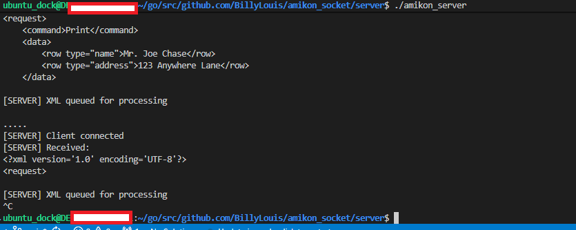
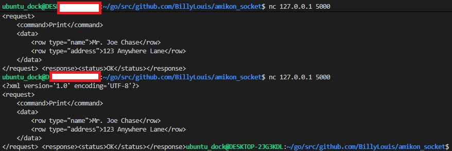
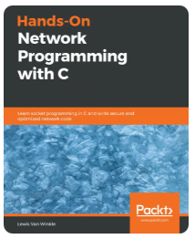

# amikon_socket
AMIKON: Application Messaging Integrated Kernel Optimized Network. 
Socket connection for inter-communication between a client and a server. 

## ITEMIZED:
- Requirements:
  - [1] Program must compile using g++ (possible use of shell script for automation)
  - [2] Application must be able to run on X86_64 Linux.
  - [3] Source, makefile, documentation, and server seperated from client code.
  - [4] Support multiple simultaneous clients
  - [5] OOP and use design pattern where appropriate
  - [6] Implement mutexes with shared data element
  - [7] Use Asynchronous flow
  - [8] Create a GTK+/OpenGL GUI for both the client and the server.

- Task Description:  
  - [1] The client simply initiates a connection, sends an XML packet, and displays the server’s response.
        The client could be a simple shell script using netcat or a small program to send an
        XML messages (from a text file) to the socket server monitor. 
  - [2] The server should accept client connections, receive XML data on that connection, 
        display the contents of the XML message, and send a response back to the client. The server should have the following characteristics:  
```shell
            [b] Take the address and port information as commandline parameters that default to 127.0.0.1 and port 5000  
            [a] Open a socket and listen for incoming data  
            [c] Receive data and determine if it is valid XML  
                [i] If it is XML, pass to a work queue that “processes” the command 
                [ii] Invalid XML should result in a display of “Unknown Command” 
            [d] Parse the command and display it to the console along with any data rows 
            [e] Send a response to the originating socket 
```  


```shell 
### Valid message format: 
# (Request)
<?xml version = '1.0' encoding = 'UTF-8'?>
<request>
    <command>Print</command>
    <data>
        <row type="name">Mr. Joe Chase</row>
        <row type="address">123 Anywhere Lane</row>
    </data>
</request>

# (Response)
<?xml version = '1.0' encoding = 'UTF-8'?>
<response>
    <command>Print</command>
    <status>Complete</status>
    <date>1970-
<\response>

```  
### Server Folder:
```shell
### Compiling, running and testing the server:
- Open a terminal while in $(HOME)/server/
- Run the command: 
$ g++ -std=c++14 main.cpp amikon_server.cpp -o amikon_server_x86_linux -pthread
- Open another ternimal while the server is running and type the command:
$ nc 127.0.0.1 5000
- Then paste the bfollowing with "CTRL+SHIFT+V" only.**IMPORTANT**:
<?xml version='1.0' encoding='UTF-8'?>
<request>
    <command>Print</command>
    <data>
        <row type="name">Mr. Joe Chase</row>
        <row type="address">123 Anywhere Lane</row>
    </data>
</request> 

- There should be the following response if the server is running smoothly:
<response><status>OK</status></response> 

As shown in the 2 images below:

```
***Terminal 1(server):***  
  
## ###
***Terminal 2(Server Test):***  
  


## ##############################################
### Client Folder:
...  
...  
...  
TBD  
...  
...  


### GTK+/OpenGL GUI (Client):
...  
...  
...  
TBD  
...  
...  

## ##############################################
##### Lessons Learned:
1- Difference between headers <arpa/inet.h> and <netinet/in.h>
```shell
These two headers are related but serve different purposes:

<netinet/in.h>
Defines constants, structures, and macros for the Internet domain.
Examples:
struct sockaddr_in
INADDR_ANY
IPPROTO_TCP, IPPROTO_UDP
AF_INET, AF_INET6
- This is included when you need to define socket address structures.

<arpa/inet.h>
Declares functions for manipulating IP addresses in text/binary form.
Examples:
inet_pton() -> Convert text to binary IP
inet_ntop() -> Convert binary IP to text
inet_addr() (legacy)
- This is included when you need to convert or format IP addresses which is not needed in our case
```

## Support & Resources
Hands-On System Programming with C++: [Packtpulishing.com](https://www.packtpub.com/en-US/product/hands-on-system-programming-with-c-9781789131772)  
Building Low Latency Applications with C++: [Packtpublishing.com](https://www.packtpub.com/en-US/product/building-low-latency-applications-with-c-9781837634477)  
Hands-on Network programming with C: [Packtpulishing.com](https://www.packtpub.com/en-US/product/hands-on-network-programming-with-c-9781789344080) 

        


## Authors
- [Billy Louis](): C/C++ code using socket for 2-way communication between a server and client.


## Badges
Hardware Team: [NSAL.com](https://NSAL.com/)

[](https://choosealicense.com/licenses/nsal/)
